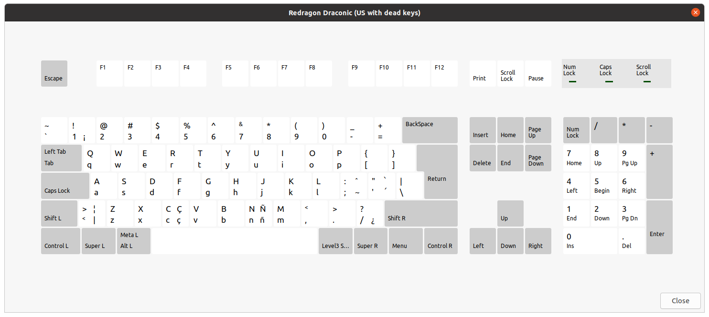

# xkb

## Redragon Draconic xkb remap with spanish and portuguese keys (Ubuntu 20.04 with Xorg display manager)



```bash
$ sudo cp drac /usr/share/X11/xkb/symbols
$ sudo cp evdev.xml.custom /usr/share/X11/xkb/rules/evdev.xml
$ sudo cp evdev.lst.custom /usr/share/X11/xkb/rules/evdev.lst
```

- Logout and login
- Select keyboard
